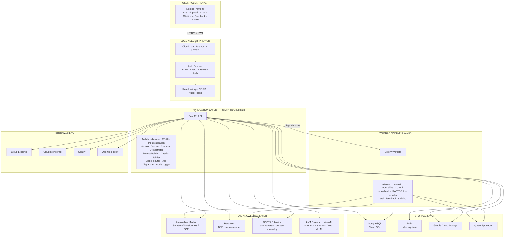
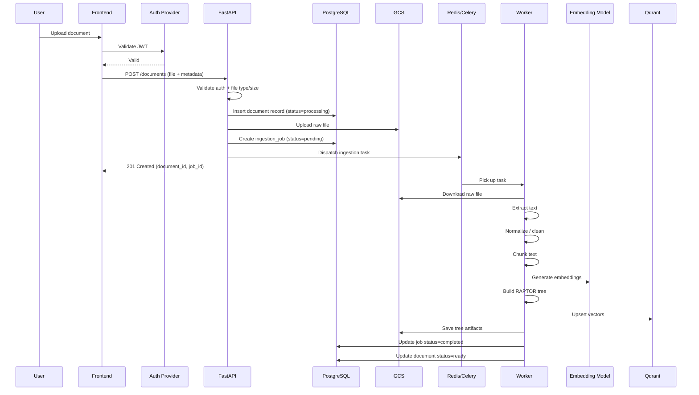
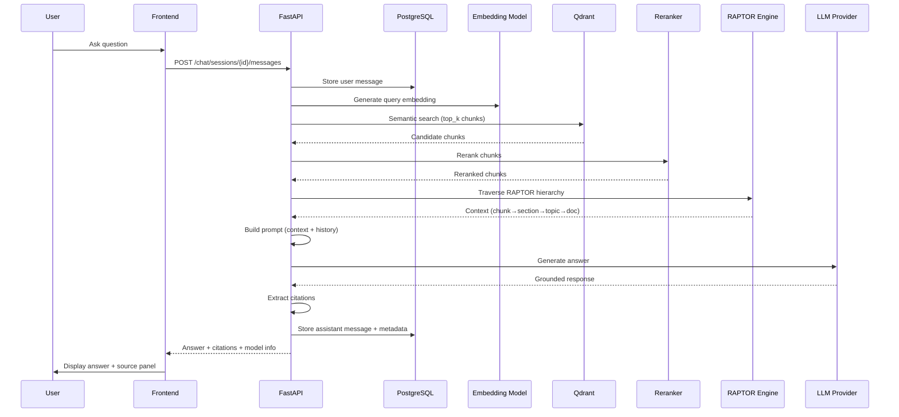
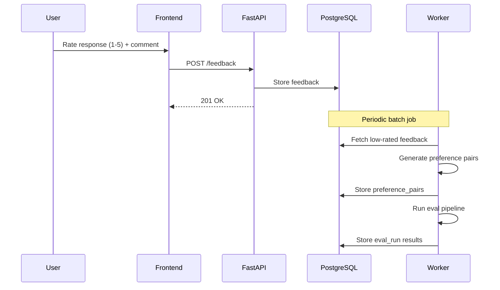

# RAPTOR RAG Platform — Architecture (GCP Production)

> Industry-standard, multi-tenant RAPTOR RAG platform designed for GCP deployment.  
> This document covers the full system design: diagrams, data flows, DB schema, API surface, and storage layout.

---

## 1. High-Level Architecture (Mermaid)



---

## 2. Detailed Component Diagram

```mermaid
flowchart LR
    subgraph Users
        IND["Individual Users"]
        TEAM["Teams / Org Users"]
        ADM["Admins"]
    end

    subgraph Frontend["Next.js Frontend"]
        LOGIN["Login / Signup"]
        DASH["Workspace Dashboard"]
        COLL["Collection Management"]
        UPLOAD["Document Upload"]
        STATUS["Ingestion Status"]
        CHAT["Chat Interface"]
        CITE["Citation Panel"]
        FB["Feedback Actions"]
        ADMIN["Admin / Ops Screens"]
    end

    subgraph AuthProv["Auth Provider — Clerk / Auth0"]
        IDENT["User Identity"]
        SESS["Session Handling"]
        JWT["JWT Issuance"]
        ROLES["Role Metadata"]
    end

    subgraph FastAPI["FastAPI API — Cloud Run"]
        direction TB
        APIS["/auth /users /workspaces /collections<br/>/documents /ingestion /chat /retrieve<br/>/generate /feedback /eval /admin"]
        SVC["Auth MW · RBAC · Validation<br/>Session Svc · Retrieval Orchestrator<br/>Prompt Builder · Citation Builder<br/>Model Router · Job Dispatcher · Audit Logger"]
    end

    subgraph DataStores
        PG2["PostgreSQL / Cloud SQL<br/>users · workspaces · collections<br/>documents · chunks_metadata · tree_nodes<br/>ingestion_jobs · sessions · messages<br/>feedback · eval_runs · audit_logs<br/>model_registry"]
        REDIS2["Redis / Memorystore<br/>Celery queue · cache<br/>rate limits · session cache"]
        GCS2["GCS<br/>raw files · extracted text · cleaned text<br/>RAPTOR trees · chunk exports<br/>eval outputs · model artifacts · backups"]
        VEC["Qdrant / pgvector<br/>chunk embeddings · metadata<br/>filtered search · similarity"]
    end

    subgraph Workers["Celery Workers"]
        W1["1. validate document"]
        W2["2. fetch raw file"]
        W3["3. extract text"]
        W4["4. normalize / clean"]
        W5["5. create chunks"]
        W6["6. create embeddings"]
        W7["7. build RAPTOR tree"]
        W8["8. store vector index"]
        W9["9. save tree artifacts"]
        W10["10. update status"]
        W11["11. eval / feedback processing"]
    end

    subgraph Intelligence["AI / Knowledge Layer"]
        EMB2["Embedding Model"]
        RR["Reranker"]
        RAPT["RAPTOR Traversal<br/>chunk→section→topic→document"]
        LITELLM["LiteLLM Router<br/>OpenAI · Anthropic · Groq · vLLM"]
    end

    Users --> Frontend
    Frontend -->|JWT| AuthProv
    AuthProv --> FastAPI
    FastAPI --> DataStores
    FastAPI -->|dispatch| Workers
    Workers --> DataStores
    Workers --> Intelligence
    FastAPI --> Intelligence
    Intelligence -->|answer + citations| FastAPI
```



---

## 3. Sequence Diagram — Document Upload + Ingestion



---

## 4. Sequence Diagram — Chat / Query Flow



---

## 5. Feedback / Improvement Loop



---

## 6. Database Schema

### Tables

```sql
-- Identity
CREATE TABLE users (
    id            UUID PRIMARY KEY DEFAULT gen_random_uuid(),
    clerk_id      TEXT UNIQUE NOT NULL,
    email         TEXT UNIQUE NOT NULL,
    display_name  TEXT,
    role          TEXT DEFAULT 'user',
    created_at    TIMESTAMPTZ DEFAULT NOW(),
    updated_at    TIMESTAMPTZ DEFAULT NOW()
);

-- Multi-tenancy
CREATE TABLE workspaces (
    id         UUID PRIMARY KEY DEFAULT gen_random_uuid(),
    name       TEXT NOT NULL,
    owner_id   UUID REFERENCES users(id) ON DELETE CASCADE,
    settings   JSONB DEFAULT '{}',
    created_at TIMESTAMPTZ DEFAULT NOW(),
    updated_at TIMESTAMPTZ DEFAULT NOW()
);

CREATE TABLE workspace_members (
    workspace_id UUID REFERENCES workspaces(id) ON DELETE CASCADE,
    user_id      UUID REFERENCES users(id) ON DELETE CASCADE,
    role         TEXT DEFAULT 'member',
    joined_at    TIMESTAMPTZ DEFAULT NOW(),
    PRIMARY KEY (workspace_id, user_id)
);

-- Knowledge organization
CREATE TABLE collections (
    id           UUID PRIMARY KEY DEFAULT gen_random_uuid(),
    workspace_id UUID REFERENCES workspaces(id) ON DELETE CASCADE,
    name         TEXT NOT NULL,
    description  TEXT,
    settings     JSONB DEFAULT '{}',
    created_at   TIMESTAMPTZ DEFAULT NOW(),
    updated_at   TIMESTAMPTZ DEFAULT NOW()
);

-- Documents
CREATE TABLE documents (
    id              UUID PRIMARY KEY DEFAULT gen_random_uuid(),
    collection_id   UUID REFERENCES collections(id) ON DELETE CASCADE,
    filename        TEXT NOT NULL,
    content_type    TEXT NOT NULL,
    file_size_bytes BIGINT,
    storage_key     TEXT NOT NULL,
    metadata        JSONB DEFAULT '{}',
    status          TEXT DEFAULT 'uploaded',
    created_at      TIMESTAMPTZ DEFAULT NOW(),
    updated_at      TIMESTAMPTZ DEFAULT NOW()
);

CREATE TABLE document_versions (
    id          UUID PRIMARY KEY DEFAULT gen_random_uuid(),
    document_id UUID REFERENCES documents(id) ON DELETE CASCADE,
    version     INT NOT NULL,
    storage_key TEXT NOT NULL,
    chunk_count INT,
    created_at  TIMESTAMPTZ DEFAULT NOW()
);

-- Chunk & tree metadata
CREATE TABLE chunks_metadata (
    id            UUID PRIMARY KEY DEFAULT gen_random_uuid(),
    document_id   UUID REFERENCES documents(id) ON DELETE CASCADE,
    collection_id UUID REFERENCES collections(id) ON DELETE CASCADE,
    chunk_index   INT NOT NULL,
    text_hash     TEXT NOT NULL,
    word_start    INT,
    word_end      INT,
    page_number   INT,
    section_title TEXT,
    vector_id     TEXT,
    created_at    TIMESTAMPTZ DEFAULT NOW()
);

CREATE TABLE tree_nodes (
    id              UUID PRIMARY KEY DEFAULT gen_random_uuid(),
    collection_id   UUID REFERENCES collections(id) ON DELETE CASCADE,
    document_id     UUID REFERENCES documents(id) ON DELETE CASCADE,
    parent_id       UUID REFERENCES tree_nodes(id) ON DELETE SET NULL,
    node_type       TEXT NOT NULL,  -- 'document', 'topic', 'section', 'chunk'
    level           INT NOT NULL DEFAULT 0,
    label           TEXT,
    summary         TEXT,
    vector_id       TEXT,
    children_count  INT DEFAULT 0,
    metadata        JSONB DEFAULT '{}',
    created_at      TIMESTAMPTZ DEFAULT NOW()
);

-- Processing
CREATE TABLE ingestion_jobs (
    id            UUID PRIMARY KEY DEFAULT gen_random_uuid(),
    document_id   UUID REFERENCES documents(id) ON DELETE CASCADE,
    status        TEXT DEFAULT 'pending',
    current_stage TEXT,
    progress_pct  SMALLINT DEFAULT 0,
    chunk_count   INT,
    error_message TEXT,
    started_at    TIMESTAMPTZ,
    completed_at  TIMESTAMPTZ,
    created_at    TIMESTAMPTZ DEFAULT NOW()
);

-- Chat
CREATE TABLE chat_sessions (
    id            UUID PRIMARY KEY DEFAULT gen_random_uuid(),
    user_id       UUID REFERENCES users(id) ON DELETE CASCADE,
    collection_id UUID REFERENCES collections(id) ON DELETE CASCADE,
    title         TEXT,
    created_at    TIMESTAMPTZ DEFAULT NOW(),
    updated_at    TIMESTAMPTZ DEFAULT NOW()
);

CREATE TABLE chat_messages (
    id          UUID PRIMARY KEY DEFAULT gen_random_uuid(),
    session_id  UUID REFERENCES chat_sessions(id) ON DELETE CASCADE,
    role        TEXT NOT NULL,
    content     TEXT NOT NULL,
    citations   JSONB,
    model_used  TEXT,
    latency_ms  INT,
    token_count INT,
    created_at  TIMESTAMPTZ DEFAULT NOW()
);

-- Feedback
CREATE TABLE feedback (
    id         UUID PRIMARY KEY DEFAULT gen_random_uuid(),
    message_id UUID UNIQUE REFERENCES chat_messages(id) ON DELETE CASCADE,
    rating     SMALLINT NOT NULL CHECK (rating BETWEEN 1 AND 5),
    comment    TEXT,
    created_at TIMESTAMPTZ DEFAULT NOW()
);

CREATE TABLE preference_pairs (
    id       UUID PRIMARY KEY DEFAULT gen_random_uuid(),
    prompt   TEXT NOT NULL,
    chosen   TEXT NOT NULL,
    rejected TEXT NOT NULL,
    source   TEXT,
    created_at TIMESTAMPTZ DEFAULT NOW()
);

-- Training
CREATE TABLE training_runs (
    id             UUID PRIMARY KEY DEFAULT gen_random_uuid(),
    run_type       TEXT NOT NULL,
    status         TEXT DEFAULT 'pending',
    base_model     TEXT NOT NULL,
    pair_count     INT,
    epochs         INT,
    metrics        JSONB,
    adapter_s3_key TEXT,
    error_message  TEXT,
    started_at     TIMESTAMPTZ,
    completed_at   TIMESTAMPTZ,
    created_at     TIMESTAMPTZ DEFAULT NOW()
);

-- Evaluation
CREATE TABLE eval_runs (
    id            UUID PRIMARY KEY DEFAULT gen_random_uuid(),
    collection_id UUID REFERENCES collections(id) ON DELETE SET NULL,
    eval_type     TEXT NOT NULL,
    status        TEXT DEFAULT 'pending',
    config        JSONB DEFAULT '{}',
    results       JSONB,
    error_message TEXT,
    started_at    TIMESTAMPTZ,
    completed_at  TIMESTAMPTZ,
    created_at    TIMESTAMPTZ DEFAULT NOW()
);

-- Operations
CREATE TABLE model_registry (
    id           UUID PRIMARY KEY DEFAULT gen_random_uuid(),
    name         TEXT NOT NULL,
    version      TEXT NOT NULL,
    model_type   TEXT NOT NULL,
    storage_key  TEXT,
    metrics      JSONB,
    is_active    BOOLEAN DEFAULT FALSE,
    created_at   TIMESTAMPTZ DEFAULT NOW(),
    UNIQUE(name, version)
);

CREATE TABLE audit_logs (
    id         UUID PRIMARY KEY DEFAULT gen_random_uuid(),
    user_id    UUID REFERENCES users(id) ON DELETE SET NULL,
    action     TEXT NOT NULL,
    resource   TEXT NOT NULL,
    resource_id UUID,
    details    JSONB,
    ip_address TEXT,
    created_at TIMESTAMPTZ DEFAULT NOW()
);
```

---

## 7. Storage System Responsibilities

### PostgreSQL (Cloud SQL)
Structured app data:
- Users, workspaces, collections
- Document metadata and processing state
- Chunk metadata and tree node references
- Chat sessions and messages
- Feedback and preference pairs
- Evaluations and training runs
- Audit logs and model registry

### Qdrant / pgvector
Vector embeddings:
- Chunk embeddings per collection
- Top-k similarity retrieval
- Metadata-filtered search (by document, collection, type)

### Google Cloud Storage (GCS)
Object/file storage:
- Original file uploads
- Extracted and cleaned text
- RAPTOR tree JSON artifacts
- Chunk exports
- Evaluation outputs
- Model artifacts/checkpoints
- Backups and snapshots

### Redis (Memorystore)
Ephemeral / queue:
- Celery task queue + retry queue
- Response caching
- Rate-limit counters
- Temporary session data

---

## 8. API Surface (v2)

| Group | Endpoint | Method | Description |
|-------|----------|--------|-------------|
| **Health** | `/api/v2/health/live` | GET | Liveness probe |
| | `/api/v2/health/ready` | GET | Readiness probe (all backends) |
| **Auth** | `/api/v2/auth/webhook` | POST | Clerk webhook (user sync) |
| | `/api/v2/auth/me` | GET | Current user profile |
| **Users** | `/api/v2/users/{id}` | GET | User profile |
| **Workspaces** | `/api/v2/workspaces` | POST/GET | Create / list workspaces |
| | `/api/v2/workspaces/{id}` | GET/DELETE | Get / delete workspace |
| **Collections** | `/api/v2/workspaces/{wid}/collections` | POST/GET | Create / list |
| | `/api/v2/workspaces/{wid}/collections/{cid}` | GET/DELETE | Get / delete |
| **Documents** | `/api/v2/collections/{cid}/documents` | POST/GET | Upload / list |
| | `/api/v2/collections/{cid}/documents/{did}` | GET/DELETE | Get / delete |
| | `/api/v2/collections/{cid}/documents/{did}/status` | GET | Ingestion status |
| **Chat** | `/api/v2/chat/sessions` | POST/GET | Create / list sessions |
| | `/api/v2/chat/sessions/{sid}` | GET/DELETE | Get / delete session |
| | `/api/v2/chat/sessions/{sid}/messages` | POST | Send message (RAG) |
| **Retrieve** | `/api/v2/retrieve` | POST | Standalone semantic search |
| **Generate** | `/api/v2/generate` | POST | Standalone generation (context + LLM) |
| **Feedback** | `/api/v2/feedback` | POST/GET | Submit / list feedback |
| **Training** | `/api/v2/training/runs` | POST/GET | Start / list training runs |
| | `/api/v2/training/runs/{rid}` | GET | Training run details |
| **Eval** | `/api/v2/eval/runs` | POST/GET | Start / list eval runs |
| | `/api/v2/eval/runs/{rid}` | GET | Eval run details |
| **Admin** | `/api/v2/admin/stats` | GET | Platform statistics |
| | `/api/v2/admin/models` | GET/POST | Model registry |
| | `/api/v2/admin/audit-logs` | GET | Audit log viewer |

---

## 9. Architecture Zones (for diagramming)

| Zone | Components |
|------|------------|
| **1. Client** | Next.js, Upload UI, Chat UI, Citation Panel, Feedback Panel, Admin Dashboard |
| **2. Security / Edge** | Clerk/Auth0, JWT validation, RBAC, Rate limiting, Audit logging, CORS |
| **3. Application** | FastAPI API, Session management, Document APIs, Retrieval APIs, Generation APIs, Feedback APIs, Admin APIs |
| **4. Processing** | Celery workers, Async ingestion, Parsing, Chunking, Embedding, RAPTOR tree generation, Reindexing, Batch eval |
| **5. Storage** | PostgreSQL (metadata), Qdrant/pgvector (vectors), GCS (files), Redis (queue/cache) |
| **6. Operations** | Cloud Logging, Cloud Monitoring, Sentry, OpenTelemetry, Alerts, Backups, CI/CD, Secret management |

---

## 10. Key Data Flows

### Ingestion Path
```
User upload → FastAPI → GCS (raw) + Postgres (metadata)
  → Redis/Celery → Worker: parse → normalize → chunk → embed → RAPTOR tree
  → Qdrant (vectors) + GCS (artifacts) + Postgres (status)
```

### Query Path
```
User question → FastAPI → Embedding model → Qdrant (top-k)
  → Reranker → RAPTOR traversal (chunk→section→topic→doc)
  → LiteLLM/LLM → Answer + citations → Frontend
```

### Improvement Path
```
User feedback → Postgres → Eval/review pipeline → Preference pairs
  → Training run (DPO/SFT) → Model registry → Active model update
```

---

## 11. Simplified Production Diagram

```
Users
  ↓
Next.js Frontend
  ↓
Auth Provider (Clerk/Auth0)
  ↓
FastAPI API (Cloud Run)
  ├── PostgreSQL / Cloud SQL
  ├── Redis / Memorystore
  ├── Google Cloud Storage
  ├── Qdrant
  ├── Celery Workers
  ├── RAPTOR Retrieval Engine
  ├── LiteLLM / LLM Providers
  └── Monitoring / Logging / Sentry
```

---

## 12. Future Optional Components

- OCR service for scanned PDFs
- Web crawler ingestion for URLs/websites
- Docx/Excel parser extensions
- Multi-tenant organization support
- Policy engine
- Dataset review queue
- Training service (full MLOps)
- Model registry UI
- Canary deployment manager
- Cost analytics dashboard
- Billing/subscription service
