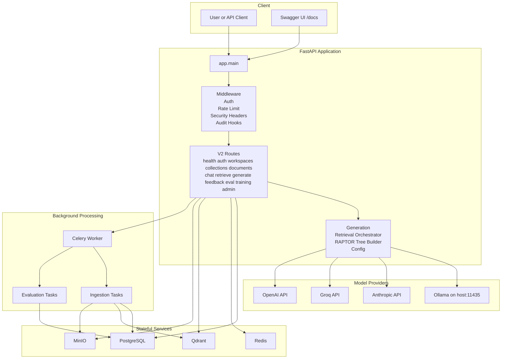
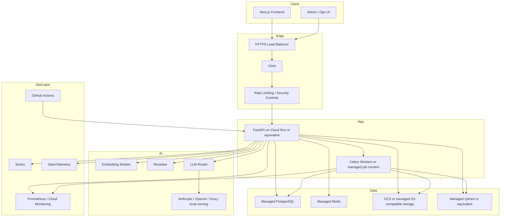

# RAPTOR RAG Platform Architecture

This document describes the architecture that exists in the repository today, plus the intended production deployment shape that the roadmap is targeting.

## 1. Scope

There are two distinct views that matter:

1. Current implementation in this repository
2. Target production deployment for a hardened multi-tenant platform

The current implementation is the source of truth for local development and testing. The production view explains the intended end state for Cloud Run / managed infrastructure style deployment.

## 2. Current Implementation

### 2.1 Runtime Topology

### 2.2 Current Service Inventory

| Service | Responsibility | Local Address |
| --- | --- | --- |
| FastAPI API | Public API, auth, retrieval, generation, admin, metrics | `http://localhost:8000` |
| PostgreSQL | Relational metadata and operational state | `localhost:5432` |
| Redis | Celery broker, cache, rate limiting state | `localhost:6379` |
| Qdrant | Vector storage for chunk and summary embeddings | `http://localhost:6335` |
| MinIO | S3-compatible document and artifact storage | `http://localhost:9000` |
| MinIO Console | Local object store console | `http://localhost:9002` |
| Ollama | Default local LLM endpoint | `http://localhost:11435` |
| Celery Worker | Background ingestion and evaluation jobs | internal Docker service |

### 2.3 Current Request Path

#### Query path

1. Client sends request to FastAPI
2. Auth middleware validates Clerk JWT or applies development bypass
3. Retrieval layer embeds the query and searches Qdrant
4. RAPTOR traversal expands chunk hits into section / topic / document context
5. Generation layer builds the prompt and calls the configured LLM provider
6. Response is stored and returned with citations

#### Ingestion path

1. Client uploads document metadata and file
2. API stores metadata in PostgreSQL and raw object in MinIO
3. Celery worker extracts text, chunks content, embeds chunks, and builds RAPTOR nodes
4. Embeddings are written to Qdrant
5. Tree / artifact outputs are written to object storage
6. Job and document status are updated in PostgreSQL

## 3. Current Code Map

| Area | Key Files |
| --- | --- |
| Application entrypoint | `app/main.py` |
| Configuration | `app/core/config.py` |
| Auth / security | `app/core/security.py` |
| Middleware | `app/core/middleware.py` |
| Generation | `app/core/generation.py` |
| Retrieval | `app/core/retrieval_orchestrator.py` |
| RAPTOR tree building | `app/core/raptor_tree_builder.py` |
| API routes | `app/api/v2/routes/*.py` |
| Worker tasks | `app/workers/tasks/*.py` |
| Database models | `app/db/models/*.py` |
| Migrations | `alembic/versions/001_initial_schema.py` |
| Local orchestration | `docker-compose.yml` |

## 4. Authentication and Authorization

### Current behavior

- Clerk is the intended identity provider
- Protected v2 endpoints use JWT-based auth middleware
- Webhook endpoint supports user synchronization
- Development bypass exists only when the app is explicitly in development and Clerk secrets are not configured
- Route-level RBAC is enforced through dependencies such as `get_current_user` and role checks

### Current role model

- `admin`
- `editor`
- `viewer`

## 5. Storage Responsibilities

### PostgreSQL

Stores structured application data:

- users
- workspaces
- collections
- documents
- ingestion jobs
- chat sessions and messages
- feedback
- evaluation runs
- training runs
- audit logs
- model metadata

### Qdrant

Stores vectorized retrieval data:

- chunk embeddings
- summary-node embeddings
- collection-scoped metadata for filtered retrieval

### MinIO / S3-compatible storage

Stores binary and artifact data:

- uploaded source files
- extracted / processed artifacts
- RAPTOR tree outputs
- model artifacts
- exports and backups

### Redis

Stores ephemeral and queue data:

- Celery broker state
- cache entries
- rate-limit counters
- short-lived coordination data

## 6. API Surface

The application mounts the following v2 route groups under `/api/v2`:

| Group | Responsibility |
| --- | --- |
| `health` | live / ready checks |
| `auth` | Clerk webhook and current user info |
| `workspaces` | workspace CRUD |
| `collections` | collection CRUD |
| `documents` | upload, list, status, delete |
| `chat` | session creation, listing, retrieval, messaging |
| `retrieve` | standalone retrieval |
| `generate` | standalone generation |
| `feedback` | feedback submission and listing |
| `eval` | evaluation run creation and tracking |
| `training` | training run creation and tracking |
| `admin` | stats, audit, model-admin functions |

Legacy v1 routes are still mounted for backward compatibility but are deprecated.

## 7. Local Deployment Profile

The local development profile uses Docker Compose with these practical details:

- Qdrant host port is remapped to `6335` because `6333` may already be in use on the host
- MinIO console host port is remapped to `9002` because `9001` may be reserved on Windows hosts
- API and worker containers access Ollama through `http://host.docker.internal:11435`
- Compose currently sets the default LLM provider to Ollama

## 8. Target Production Deployment

The target production deployment remains cloud-oriented and more opinionated than the current local stack.

### Production intent

- Managed relational database
- Managed vector database or hardened self-hosted vector layer
- Managed object storage
- CI/CD with deployment gates
- Observability and alerting enabled by default
- Stronger secret validation and rotation
- Modern frontend replacing the remaining legacy/demo UI path

## 9. Known Architectural Gaps

The repository is not yet at the final target state. The most important gaps are:

- frontend is not yet at the planned modern production shape
- backup and disaster recovery automation are not complete
- generation fallback behavior is not fully standardized across providers
- some legacy demo-era code and documentation still exist outside the main v2 path
- citation enrichment and streaming are still roadmap items

Those gaps are tracked in `ROADMAP_TO_100.md`.

## 10. Source of Truth

Use these files as the operational source of truth:

- `docker-compose.yml` for local runtime wiring
- `.env.example` for environment configuration contract
- `app/main.py` for active API mount points
- `app/core/config.py` for configuration behavior
- `ROADMAP_TO_100.md` for readiness scoring and remaining engineering work
