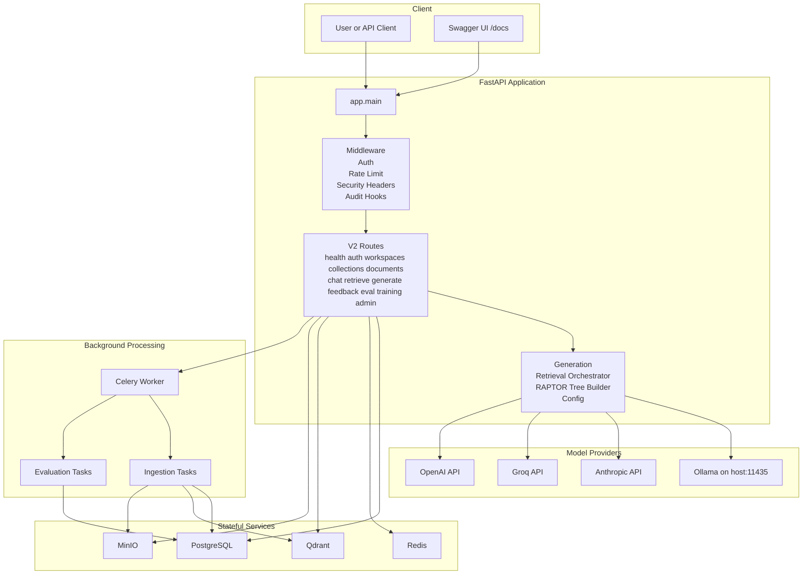
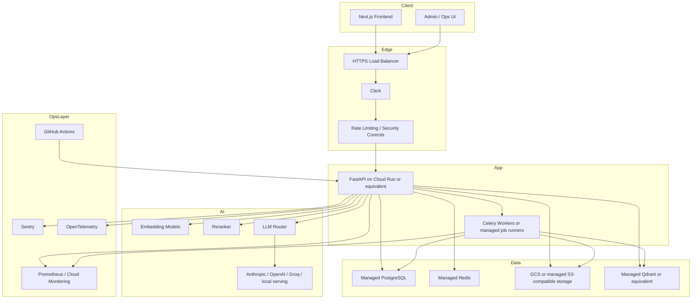

# RAPTOR RAG Platform Architecture

This document describes the architecture that exists in the repository today, plus the intended production deployment shape that the roadmap is targeting.

## 1. Scope

There are two distinct views that matter:

1. Current implementation in this repository
2. Target production deployment for a hardened multi-tenant platform

The current implementation is the source of truth for local development and testing. The production view explains the intended end state for Cloud Run / managed infrastructure style deployment.

## 2. Current Implementation

### 2.1 Runtime Topology

### 2.2 Current Service Inventory

| Service       | Responsibility                                          | Local Address            |
| ------------- | ------------------------------------------------------- | ------------------------ |
| FastAPI API   | Public API, auth, retrieval, generation, admin, metrics | `http://localhost:8000`  |
| PostgreSQL    | Relational metadata and operational state               | `localhost:5432`         |
| Redis         | Celery broker, cache, rate limiting state               | `localhost:6379`         |
| Qdrant        | Vector storage for chunk and summary embeddings         | `http://localhost:6335`  |
| MinIO         | S3-compatible document and artifact storage             | `http://localhost:9000`  |
| MinIO Console | Local object store console                              | `http://localhost:9002`  |
| Ollama        | Default local LLM endpoint                              | `http://localhost:11435` |
| Celery Worker | Background ingestion and evaluation jobs                | internal Docker service  |

### 2.3 Current Request Path

#### Query path

1. Client sends request to FastAPI
2. Auth middleware validates Clerk JWT or applies development bypass
3. Retrieval layer embeds the query and searches Qdrant
4. RAPTOR traversal expands chunk hits into section / topic / document context
5. Generation layer builds the prompt and calls the configured LLM provider
6. Response is stored and returned with citations

#### Ingestion path

1. Client uploads document metadata and file
2. API stores metadata in PostgreSQL and raw object in MinIO
3. Celery worker extracts text, chunks content, embeds chunks, and builds RAPTOR nodes
4. Embeddings are written to Qdrant
5. Tree / artifact outputs are written to object storage
6. Job and document status are updated in PostgreSQL

## 3. Current Code Map

| Area                   | Key Files                                |
| ---------------------- | ---------------------------------------- |
| Application entrypoint | `app/main.py`                            |
| Configuration          | `app/core/config.py`                     |
| Auth / security        | `app/core/security.py`                   |
| Middleware             | `app/core/middleware.py`                 |
| Generation             | `app/core/generation.py`                 |
| Retrieval              | `app/core/retrieval_orchestrator.py`     |
| RAPTOR tree building   | `app/core/raptor_tree_builder.py`        |
| API routes             | `app/api/v2/routes/*.py`                 |
| Worker tasks           | `app/workers/tasks/*.py`                 |
| Database models        | `app/db/models/*.py`                     |
| Migrations             | `alembic/versions/001_initial_schema.py` |
| Local orchestration    | `docker-compose.yml`                     |

## 3.1 Technology Stack Detail

| Concern | Technology | Current usage in this repository |
| --- | --- | --- |
| HTTP API | FastAPI | Main application server, dependency injection, route grouping, OpenAPI docs |
| ASGI server | Uvicorn | Local application serving |
| Background jobs | Celery | Async ingestion and evaluation execution |
| Broker / transient state | Redis | Celery broker, cache, and rate-limit storage |
| Relational persistence | PostgreSQL | Users, workspaces, collections, documents, chat, jobs, feedback, audit, training state |
| Vector persistence | Qdrant | Chunk-level and summary-level embedding search |
| Object storage | MinIO / S3-compatible API | Source files, artifacts, trees, model outputs |
| Embeddings | Sentence Transformers | Query and document vectorization |
| Hierarchical retrieval | RAPTOR | Tree-structured context expansion above chunks |
| LLM routing | LiteLLM + direct clients | Provider abstraction across Ollama and cloud providers |
| Local model serving | Ollama | Default local generation path |
| AuthN/AuthZ | Clerk + route role checks | JWT validation and role-aware API access |
| ORM / migrations | SQLAlchemy + Alembic | Data model mapping and schema evolution |
| Observability | Prometheus / OpenTelemetry / audit hooks | Metrics, tracing hooks, and audit records |
| Developer runtime | Docker Compose | Local orchestration of API, worker, DB, cache, vector store, storage |
| CI / CD | GitHub Actions | Lint, security, tests, image builds, and deploy pipeline |

## 3.2 Module Responsibilities

### Application layer

| Path | Responsibility |
| --- | --- |
| `app/main.py` | Bootstraps FastAPI, mounts v1/v2 routes, registers middleware, exceptions, and telemetry |
| `app/api/mcp_server.py` | Legacy MCP-style request flow and compatibility surface |
| `app/api/chat.py` | Legacy session-oriented chat API |
| `app/api/retrieve.py` | Legacy retrieval and paper-specific endpoints |
| `app/api/train.py` | Legacy training, preference, and learning-loop routes |
| `app/api/eval.py` | Legacy evaluation endpoints |

### V2 API layer

| Route module | Responsibility |
| --- | --- |
| `app/api/v2/routes/health.py` | Live and readiness checks across storage and infra dependencies |
| `app/api/v2/routes/auth.py` | Clerk webhook sync and current-user identity APIs |
| `app/api/v2/routes/workspaces.py` | Workspace CRUD and pagination |
| `app/api/v2/routes/collections.py` | Collection lifecycle and collection scoping |
| `app/api/v2/routes/documents.py` | Document upload and ingestion job dispatch |
| `app/api/v2/routes/chat.py` | Session-backed RAG chat APIs |
| `app/api/v2/routes/retrieve.py` | Retrieval-only APIs for evidence access |
| `app/api/v2/routes/generate.py` | Generation APIs with or without retrieval context |
| `app/api/v2/routes/feedback.py` | Feedback submission on assistant messages |
| `app/api/v2/routes/eval.py` | Evaluation-run creation and status tracking |
| `app/api/v2/routes/training.py` | Training-run orchestration |
| `app/api/v2/routes/admin.py` | Stats, audit logs, and model admin operations |

### Core services layer

| Core module | Responsibility |
| --- | --- |
| `app/core/config.py` | Service endpoints, provider config, auth settings, and runtime flags |
| `app/core/security.py` | Authentication middleware, JWT verification, role enforcement |
| `app/core/middleware.py` | Security headers, rate limiting, middleware stack registration |
| `app/core/retrieval_orchestrator.py` | Main retrieval pipeline for the v2 platform |
| `app/core/retrieval.py` | Legacy retriever abstraction used by older routes and UI helpers |
| `app/core/generation.py` | Prompt-to-answer flow and provider routing |
| `app/core/llm_client.py` | Direct provider and fine-tuned model inference integration |
| `app/core/embedding.py` | Embedding-model adapter |
| `app/core/reranker.py` | Optional reranking layer after initial vector search |
| `app/core/raptor_tree_builder.py` | Builds hierarchical summary nodes during ingestion |
| `app/core/raptor_index.py` | Reads/writes RAPTOR tree artifacts and traversal helpers |
| `app/core/prompt.py` | Prompt templates, system prompts, and task instructions |
| `app/core/prompt_builder.py` | Builds prompts and message lists from context and history |
| `app/core/feedback.py` | Feedback persistence and aggregation |
| `app/core/preference.py` | Preference-pair generation from feedback |
| `app/core/evaluation.py` | Evaluation and scoring workflows |
| `app/core/finetune.py` | Fine-tuning orchestration and model registration |
| `app/core/learning_loop.py` | Automated retraining / model promotion loop |
| `app/core/session.py` | In-memory session support for legacy flows and UI |
| `app/core/ingestion.py` | Script-oriented ingestion helpers and arXiv/PDF utilities |

### Persistence and integration layer

| Path | Responsibility |
| --- | --- |
| `app/db/models/*.py` | SQLAlchemy models for operational metadata |
| `app/storage/vector_store.py` | Qdrant integration used by the main platform |
| `app/storage/object_store.py` | Storage-provider abstraction over S3/MinIO and GCS |
| `app/storage/s3_client.py` | MinIO / S3-compatible implementation |
| `app/storage/gcs_client.py` | GCS implementation for production-target storage |
| `app/storage/cache.py` | Redis-backed cache and rate-limit primitives |
| `app/workers/tasks/ingest.py` | End-to-end async ingestion pipeline task |
| `app/workers/tasks/evaluate.py` | Async evaluation task execution |

## 4. Authentication and Authorization

### Current behavior

- Clerk is the intended identity provider
- Protected v2 endpoints use JWT-based auth middleware
- Webhook endpoint supports user synchronization
- Development bypass exists only when the app is explicitly in development and Clerk secrets are not configured
- Route-level RBAC is enforced through dependencies such as `get_current_user` and role checks

### Current role model

- `admin`
- `editor`
- `viewer`

## 5. Storage Responsibilities

### PostgreSQL

Stores structured application data:

- users
- workspaces
- collections
- documents
- ingestion jobs
- chat sessions and messages
- feedback
- evaluation runs
- training runs
- audit logs
- model metadata

### Qdrant

Stores vectorized retrieval data:

- chunk embeddings
- summary-node embeddings
- collection-scoped metadata for filtered retrieval

### MinIO / S3-compatible storage

Stores binary and artifact data:

- uploaded source files
- extracted / processed artifacts
- RAPTOR tree outputs
- model artifacts
- exports and backups

### Redis

Stores ephemeral and queue data:

- Celery broker state
- cache entries
- rate-limit counters
- short-lived coordination data

## 6. API Surface

The application mounts the following v2 route groups under `/api/v2`:

| Group         | Responsibility                                  |
| ------------- | ----------------------------------------------- |
| `health`      | live / ready checks                             |
| `auth`        | Clerk webhook and current user info             |
| `workspaces`  | workspace CRUD                                  |
| `collections` | collection CRUD                                 |
| `documents`   | upload, list, status, delete                    |
| `chat`        | session creation, listing, retrieval, messaging |
| `retrieve`    | standalone retrieval                            |
| `generate`    | standalone generation                           |
| `feedback`    | feedback submission and listing                 |
| `eval`        | evaluation run creation and tracking            |
| `training`    | training run creation and tracking              |
| `admin`       | stats, audit, model-admin functions             |

Legacy v1 routes are still mounted for backward compatibility but are deprecated.

## 7. Local Deployment Profile

The local development profile uses Docker Compose with these practical details:

- Qdrant host port is remapped to `6335` because `6333` may already be in use on the host
- MinIO console host port is remapped to `9002` because `9001` may be reserved on Windows hosts
- API and worker containers access Ollama through `http://host.docker.internal:11435`
- Compose currently sets the default LLM provider to Ollama

## 8. Target Production Deployment

The target production deployment remains cloud-oriented and more opinionated than the current local stack.

### Production intent

- Managed relational database
- Managed vector database or hardened self-hosted vector layer
- Managed object storage
- CI/CD with deployment gates
- Observability and alerting enabled by default
- Stronger secret validation and rotation
- Modern frontend replacing the remaining legacy/demo UI path

## 9. Known Architectural Gaps

The repository is not yet at the final target state. The most important gaps are:

- frontend is not yet at the planned modern production shape
- backup and disaster recovery automation are not complete
- generation fallback behavior is not fully standardized across providers
- some legacy demo-era code and documentation still exist outside the main v2 path
- citation enrichment and streaming are still roadmap items

Those gaps are tracked in `ROADMAP_TO_100.md`.

## 10. Source of Truth

Use these files as the operational source of truth:

- `docker-compose.yml` for local runtime wiring
- `.env.example` for environment configuration contract
- `app/main.py` for active API mount points
- `app/core/config.py` for configuration behavior
- `ROADMAP_TO_100.md` for readiness scoring and remaining engineering work

## 11. Architecture by Concern

### 11.1 Request-serving architecture

- FastAPI is the control plane for user-facing operations.
- Middleware enforces request shaping before business logic runs.
- Route groups map cleanly to platform domains: workspaces, documents, chat, retrieval, feedback, evaluation, training, and admin.
- Business logic is intentionally pushed into `app/core` so routes stay thin and orchestration remains testable.

### 11.2 Ingestion architecture

- The API receives the upload and records the source-of-truth metadata.
- Celery takes ownership of long-running work to avoid blocking request threads.
- The worker performs text extraction, normalization, chunking, embedding, RAPTOR summarization, vector indexing, and job-state updates.
- PostgreSQL stores document/job state, Qdrant stores retrieval vectors, and MinIO stores file/artifact outputs.

### 11.3 Retrieval architecture

- Query text is embedded first.
- Qdrant returns top candidate chunk hits.
- RAPTOR traversal expands those hits upward into section/topic/document summaries.
- The orchestrator produces both context text and structured citations.
- This layered retrieval shape is what differentiates the platform from plain chunk-only RAG.

### 11.4 Generation architecture

- Prompt construction is separated from model execution.
- `prompt.py` defines intent-specific instructions.
- `prompt_builder.py` converts retrieved evidence and chat history into message payloads.
- `generation.py` and `llm_client.py` choose providers, execute inference, and normalize output.
- Ollama remains the default local path, with cloud-provider fallback available when configured.

### 11.5 Data and governance architecture

- PostgreSQL is the operational backbone and audit trail.
- Feedback and evaluation flows create a path from user behavior to model improvement.
- Training metadata and model registry entries keep fine-tuned artifacts traceable.
- Audit records and admin routes support operational introspection.

### 11.6 Deployment architecture

- Local development uses Docker Compose and local Ollama.
- CI validates style, security, tests, and image builds on every push to `main` and on PRs.
- Deploy workflow targets a Cloud Run / Artifact Registry shape and intentionally skips docs-only pushes.
- The production target keeps API, workers, storage, and AI providers loosely coupled for service replacement over time.
