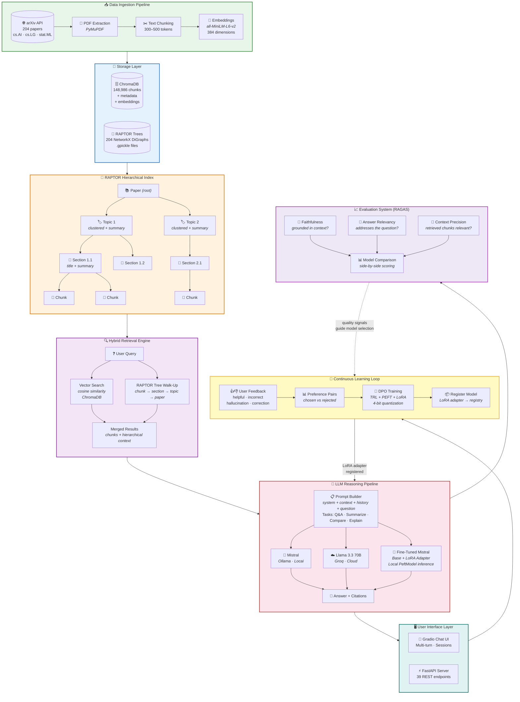
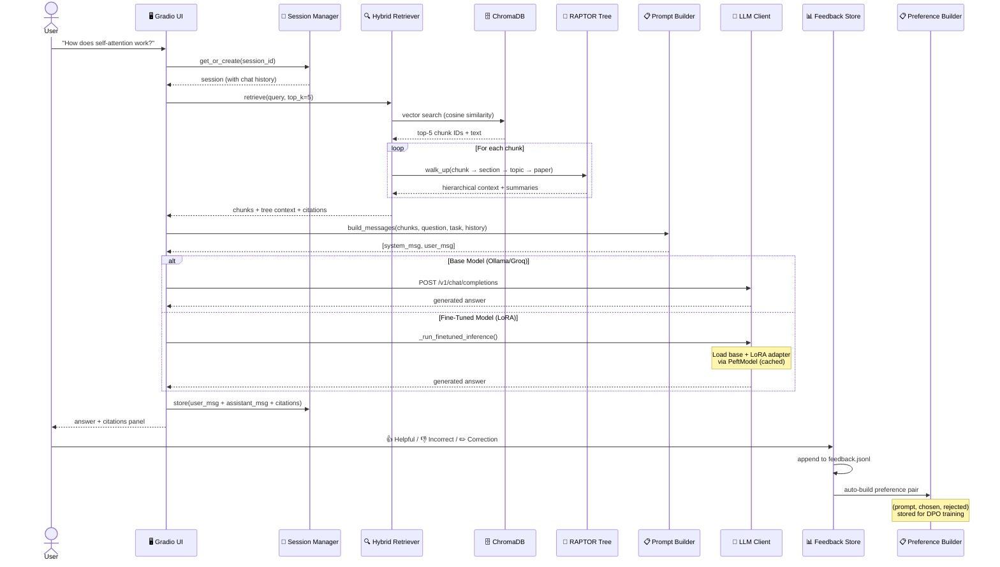
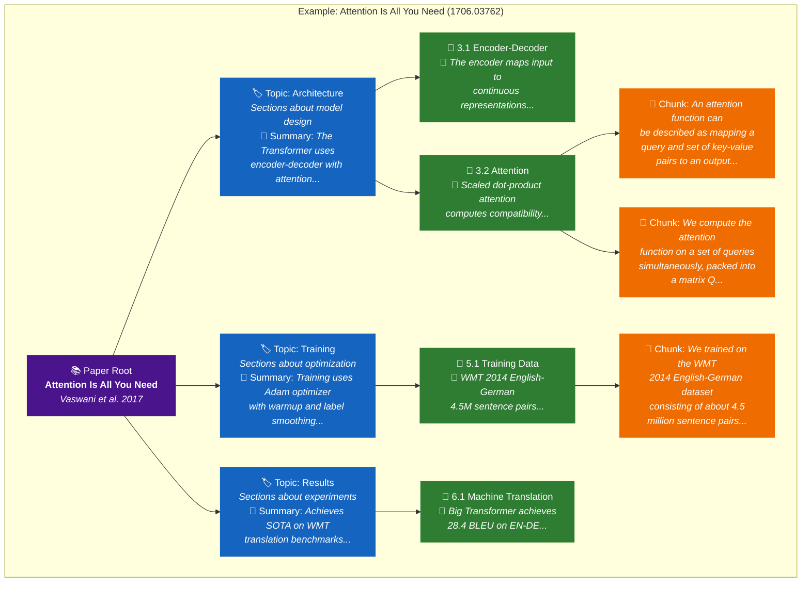
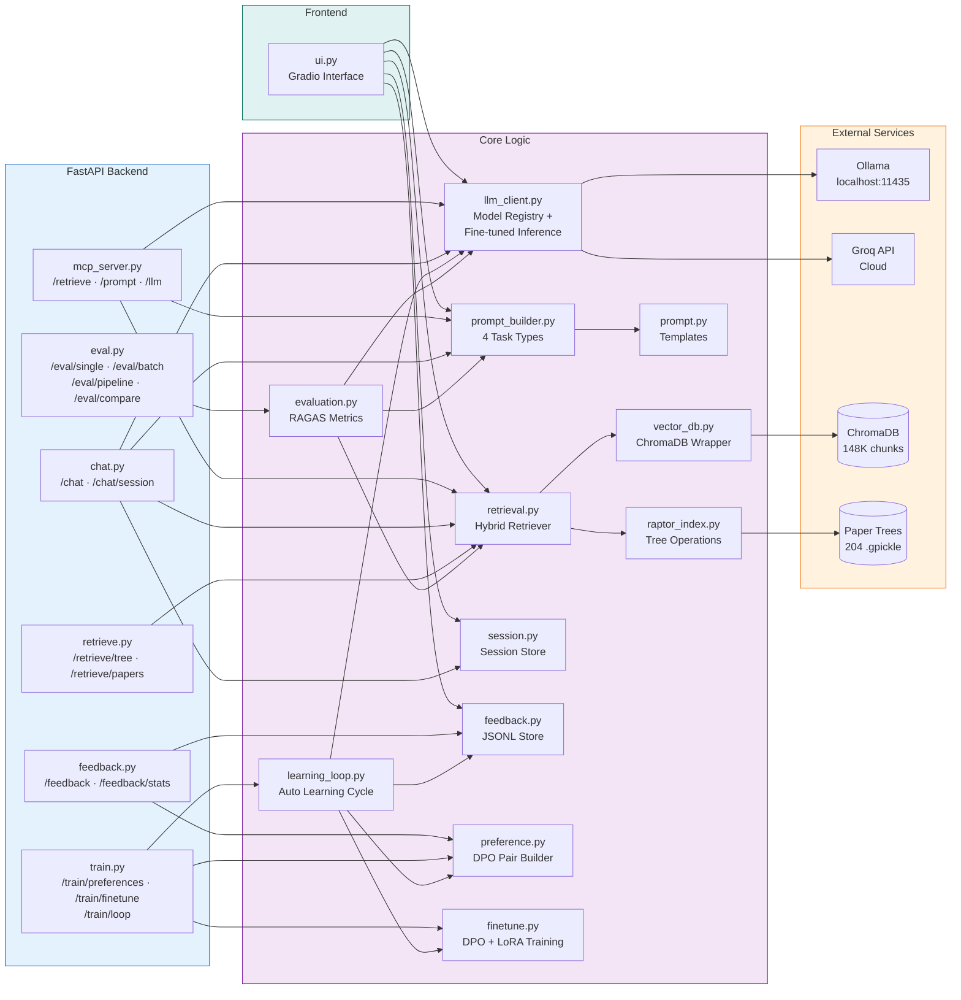
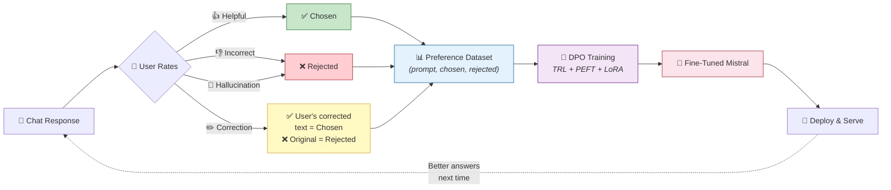
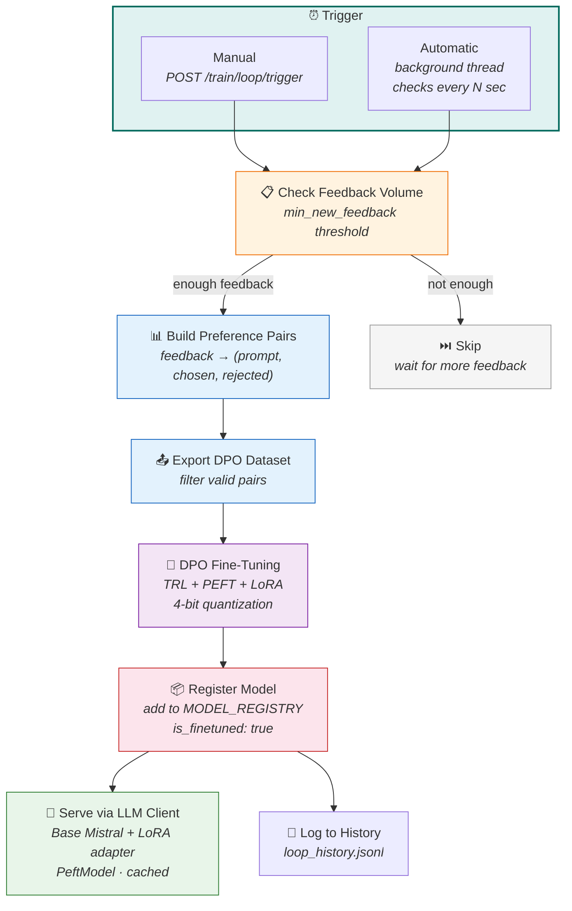
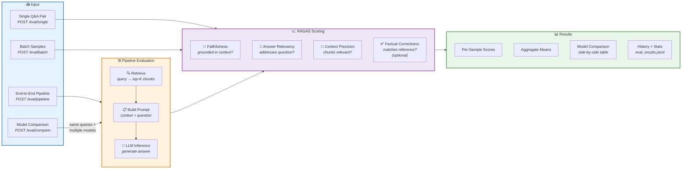

# RAPTOR Research Assistant

> **Status: In Progress** — Sections 1–14 of 18 complete. Core RAG pipeline, RLHF/DPO fine-tuning loop, continuous learning, and RAGAS evaluation system all operational.

A modular AI research assistant that reads, summarizes, compares, and reasons over 200+ ML/DL research papers using **RAPTOR** (Recursive Abstractive Processing for Tree-Organized Retrieval) — a hierarchical RAG approach that organizes papers into tree structures for deeper context-aware retrieval.

The system features multi-model LLM reasoning (local Ollama + cloud APIs), a two-way chatbot with session memory, user feedback collection, preference-based DPO fine-tuning with LoRA adapters, a continuous learning loop, and RAGAS-powered evaluation.

---

## Architecture Overview

### High-Level System Architecture



### Request Flow — What Happens When You Ask a Question



### RAPTOR Tree Structure — How Papers Are Organized



### Component Interaction Map



### Feedback → Fine-Tuning Pipeline



### Continuous Learning Loop — Automated Improvement Cycle



### Evaluation Pipeline — RAGAS Quality Measurement



---

## Project Structure

```
raptor-research-assistant/
│
├── app/
│   ├── api/                    # FastAPI endpoints (39 routes)
│   │   ├── mcp_server.py       # Main server: /retrieve, /prompt, /llm
│   │   ├── chat.py             # /chat endpoints with session support
│   │   ├── feedback.py         # /feedback endpoints
│   │   ├── retrieve.py         # /retrieve router (hybrid search)
│   │   ├── train.py            # /train: preferences, finetune, learning loop
│   │   └── eval.py             # /eval: RAGAS evaluation endpoints
│   │
│   ├── core/                   # Business logic
│   │   ├── raptor_index.py     # RAPTOR tree operations (NetworkX)
│   │   ├── retrieval.py        # Hybrid retriever (vector + tree)
│   │   ├── vector_db.py        # ChromaDB wrapper
│   │   ├── prompt_builder.py   # Prompt assembly (4 task types)
│   │   ├── prompt.py           # Prompt templates
│   │   ├── llm_client.py       # Multi-model LLM client + fine-tuned inference
│   │   ├── session.py          # In-memory session manager
│   │   ├── feedback.py         # Feedback storage (JSONL)
│   │   ├── embedding.py        # SentenceTransformers embeddings
│   │   ├── ingestion.py        # arXiv paper fetching
│   │   ├── pdf_processing.py   # PDF text extraction
│   │   ├── preference.py       # Preference dataset (DPO pairs from feedback)
│   │   ├── finetune.py         # DPO fine-tuning (TRL + PEFT + LoRA)
│   │   ├── learning_loop.py    # Continuous learning loop orchestrator
│   │   └── evaluation.py       # RAGAS evaluation system
│   │
│   ├── frontend/
│   │   └── ui.py               # Gradio chat interface
│   │
│   └── utils/
│       └── helpers.py          # Shared utilities
│
├── scripts/                    # Pipeline & utility scripts
│   ├── build_index.py          # Build RAPTOR trees + summaries
│   ├── ingest_papers.py        # Fetch papers from arXiv
│   ├── process_pdfs.py         # Extract text from PDFs
│   ├── generate_embeddings.py  # Create embeddings
│   ├── store_embeddings_in_chroma.py
│   ├── walkthrough_example.py  # Demo: full pipeline walkthrough
│   └── ...                     # Various utility scripts
│
├── tests/
│   └── test_raptor_index.py    # 27 tests for tree operations
│
├── data/                       # (gitignored — local data)
│   ├── raw/                    # PDFs, metadata, paper trees
│   ├── embeddings/             # Cached embeddings
│   ├── processed/              # Processed text
│   ├── feedback/               # User feedback + loop history JSONL
│   ├── preference/             # DPO preference pairs JSONL
│   └── evaluation/             # RAGAS evaluation results JSONL
│
├── models/                     # Fine-tuned model outputs (LoRA adapters)
├── config.yaml                 # All configuration
├── requirements.txt            # Python dependencies
└── PROJECT_PLAN.md             # Full 18-section project plan
```

---

## How It Works

### 1. Data Pipeline (Sections 1–4)

Papers are fetched from **arXiv** (categories: cs.AI, cs.LG, stat.ML), PDFs are extracted and split into 300–500 token chunks, each chunk is embedded using **SentenceTransformers** (`all-MiniLM-L6-v2`, 384-dim vectors), and stored in **ChromaDB** (148,986 chunks from 204 papers).

### 2. RAPTOR Hierarchical Index (Section 5)

Each paper is organized into a **4-level tree** using NetworkX:

```
Paper (root) → Topics (clustered) → Sections → Chunks
```

- **Topic clustering**: Sections with similar embeddings are grouped using Agglomerative Clustering (scikit-learn)
- **Summaries**: Each section and topic gets an LLM-generated summary for richer context
- **Tree traversal**: When a chunk is retrieved, the system walks up the tree to get section → topic → paper context

Currently: 204 papers indexed, 105 with full 4-level trees, 1,349 sections, 659 topics.

### 3. Hybrid Retrieval Engine (Section 6)

On every query, two retrieval strategies run in parallel:

1. **Vector search**: Embed the query → cosine similarity search in ChromaDB → top-K chunks
2. **RAPTOR tree walk-up**: For each retrieved chunk, walk up the tree to attach hierarchical context (section summary, topic summary, paper title)

This gives the LLM both the specific text AND the broader context of where that text fits in the paper's structure.

### 4. Prompt Construction (Section 7)

Prompts are assembled with 4 task-specific templates:

| Task          | Purpose                                 | Temperature |
| ------------- | --------------------------------------- | ----------- |
| **Q&A**       | Answer questions from retrieved context | 0.3         |
| **Summarize** | Summarize papers or topics              | 0.2         |
| **Compare**   | Compare findings across papers          | 0.3         |
| **Explain**   | Step-by-step concept explanation        | 0.4         |

Each prompt includes: System instruction → Hierarchical context blocks → Chat history → User question → Task-specific instructions.

### 5. Multi-Model LLM Reasoning (Section 8)

Supports switching between models per request:

| Model                  | Type             | Use Case                                            |
| ---------------------- | ---------------- | --------------------------------------------------- |
| **Mistral** (Ollama)   | Local, on-device | Default for all inference, will be fine-tuned later |
| **Groq Llama 3.3 70B** | Cloud API        | Bulk summarization, high-quality answers            |

Task-specific generation parameters (temperature, max_tokens) are automatically applied based on the task type.

### 6. Two-Way Chatbot (Section 9)

- **Session management**: Each chat gets a unique session ID with stored history (questions, answers, citations, timestamps)
- **Multi-turn context**: Last 10 conversation turns are passed to the LLM for context-aware follow-up responses
- **Gradio UI**: Chat window + settings panel + citation display + session management
- **FastAPI endpoints**: `POST /chat`, `GET /chat/sessions`, `GET /chat/session/{id}`

### 7. Feedback System (Section 10)

After each answer, users can rate the response:

| Feedback          | Meaning                      | Used For                        |
| ----------------- | ---------------------------- | ------------------------------- |
| **Helpful**       | Accurate and useful          | "Chosen" in preference pairs    |
| **Incorrect**     | Factual errors               | "Rejected" in preference pairs  |
| **Hallucination** | Made up info not in sources  | "Rejected" in preference pairs  |
| **Correction**    | User writes corrected answer | Corrected text becomes "chosen" |

Feedback is stored in JSONL format with full context (question, answer, citations, model, session) — ready for preference dataset creation.

### 8. Preference Dataset (Section 11)

Feedback entries are automatically converted into **DPO preference pairs** (chosen vs. rejected):

- **Helpful** feedback → the original answer becomes the "chosen" response
- **Incorrect / Hallucination** → the original answer becomes "rejected"
- **Correction** → the user's corrected text becomes "chosen", original becomes "rejected"

Each pair stores the full prompt (system + context + question) so it can be used directly for DPO fine-tuning. Auto-build triggers on every feedback submission.

**Endpoints**: `POST /train/preferences/build`, `GET /train/preferences`, `GET /train/preferences/stats`, `GET /train/preferences/export`

### 9. DPO Fine-Tuning (Section 12)

Full fine-tuning pipeline using **TRL** (DPOTrainer) with **PEFT** (LoRA adapters) and 4-bit quantization:

- **Base model**: Mistral-7B-v0.1 (configurable)
- **LoRA config**: r=16, alpha=32, targets q/k/v/o projections
- **Quantization**: 4-bit NF4 via BitsAndBytes
- **Training**: DPO with β=0.1, auto gradient accumulation
- **Output**: LoRA adapters saved to `models/dpo_<timestamp>/`

Registered fine-tuned models are automatically available for inference — `llm_client.py` detects `is_finetuned` and loads the base model + LoRA adapter locally using PeftModel.

**Endpoints**: `POST /train/finetune`, `GET /train/finetune/status`, `GET /train/finetune/models`, `POST /train/finetune/register`

### 10. Continuous Learning Loop (Section 13)

Automated orchestrator that closes the loop: feedback → preferences → training → deployment:

1. Check if enough new feedback has accumulated (configurable threshold)
2. Build preference pairs from recent feedback
3. Export training-ready DPO data
4. Run DPO fine-tuning
5. Register the new model and set as active

Supports both **manual triggering** and **automatic mode** (background thread checks every N seconds). History of all loop runs is stored in JSONL.

**Endpoints**: `POST /train/loop/trigger`, `GET /train/loop/status`, `POST /train/loop/auto`, `GET /train/loop/history`, `GET /train/loop/model`, `PUT /train/loop/config`

### 11. Evaluation System (Section 14)

RAGAS-powered evaluation for measuring RAG quality:

| Metric                          | What It Measures                              |
| ------------------------------- | --------------------------------------------- |
| **Faithfulness**                | Is the answer grounded in retrieved context?  |
| **Answer Relevancy**            | Does the answer address the question?         |
| **Context Precision**           | Are the retrieved chunks relevant?            |
| **Factual Correctness**         | Does the answer match a reference? (optional) |

Supports single evaluation, batch evaluation, end-to-end pipeline evaluation (query → retrieve → answer → score), and multi-model comparison (same queries across different models).

**Endpoints**: `POST /eval/single`, `POST /eval/batch`, `POST /eval/pipeline`, `POST /eval/compare`, `GET /eval/history`, `GET /eval/stats`

---

## API Endpoints (39 routes)

| Endpoint                       | Method | Description                                        |
| ------------------------------ | ------ | -------------------------------------------------- |
| `/retrieve`                    | POST   | Hybrid vector + tree retrieval                     |
| `/retrieve/tree`               | POST   | Browse by topic/section                            |
| `/retrieve/papers`             | GET    | List all 204 paper IDs                             |
| `/retrieve/paper/{id}`         | GET    | Paper tree overview                                |
| `/prompt`                      | POST   | Retrieve + build prompt                            |
| `/llm`                         | POST   | Full pipeline: retrieve → prompt → LLM answer      |
| `/llm/models`                  | GET    | List available models (incl. fine-tuned)           |
| `/llm/health`                  | GET    | Check if LLM is responding                         |
| `/chat`                        | POST   | Session-aware chat (auto-creates session)          |
| `/chat/session`                | POST   | Create new session                                 |
| `/chat/session/{id}`           | GET    | Get session history                                |
| `/chat/sessions`               | GET    | List all sessions                                  |
| `/chat/session/{id}`           | DELETE | Delete session                                     |
| `/feedback`                    | POST   | Submit feedback                                    |
| `/feedback`                    | GET    | Get all feedback                                   |
| `/feedback/stats`              | GET    | Feedback statistics                                |
| `/feedback/session/{id}`       | GET    | Feedback for a session                             |
| `/feedback/type/{type}`        | GET    | Filter by feedback type                            |
| `/train/preferences/build`     | POST   | Build preference pairs from feedback               |
| `/train/preferences`           | GET    | Get all preference pairs                           |
| `/train/preferences/stats`     | GET    | Preference dataset statistics                      |
| `/train/preferences/export`    | GET    | Export DPO training pairs                          |
| `/train/finetune`              | POST   | Start DPO fine-tuning run                          |
| `/train/finetune/status`       | GET    | Check training progress                            |
| `/train/finetune/models`       | GET    | List fine-tuned models                             |
| `/train/finetune/register`     | POST   | Register fine-tuned model for inference            |
| `/train/loop/trigger`          | POST   | Manually trigger learning loop cycle               |
| `/train/loop/status`           | GET    | Learning loop state                                |
| `/train/loop/auto`             | POST   | Enable/disable automatic loop                      |
| `/train/loop/history`          | GET    | History of all loop runs                           |
| `/train/loop/model`            | GET    | Currently selected best model                      |
| `/train/loop/config`           | PUT    | Update loop configuration                          |
| `/eval/single`                 | POST   | Evaluate a single Q&A pair (RAGAS)                 |
| `/eval/batch`                  | POST   | Evaluate a batch of Q&A samples                    |
| `/eval/pipeline`               | POST   | End-to-end RAG pipeline evaluation                 |
| `/eval/compare`                | POST   | Compare multiple models side-by-side               |
| `/eval/history`                | GET    | Recent evaluation results                          |
| `/eval/stats`                  | GET    | Aggregate evaluation statistics                    |

---

## Quick Start

### Prerequisites

- Python 3.10+
- [Ollama](https://ollama.ai/) with Mistral model pulled (`ollama pull mistral`)

### Setup

```bash
# Clone the repo
git clone https://github.com/priyankmistry21699-web/raptor-research-assistant.git
cd raptor-research-assistant

# Create virtual environment
python -m venv .venv
.venv\Scripts\activate  # Windows
# source .venv/bin/activate  # Linux/Mac

# Install dependencies
pip install -r requirements.txt

# Create .env file
echo LLM_API_KEY=ollama > .env
echo LLM_API_URL=http://localhost:11434/v1/chat/completions >> .env
echo LLM_MODEL=mistral:latest >> .env
```

### Run

```bash
# Option 1: Gradio Chat UI (interactive)
python -m app.frontend.ui
# Opens at http://localhost:7860

# Option 2: FastAPI Server (API)
uvicorn app.api.mcp_server:app --port 8000
# API docs at http://localhost:8000/docs
```

---

## Tech Stack

| Component        | Technology                              |
| ---------------- | --------------------------------------- |
| **Embeddings**   | SentenceTransformers (all-MiniLM-L6-v2) |
| **Vector DB**    | ChromaDB                                |
| **Tree Index**   | NetworkX (DiGraph)                      |
| **Clustering**   | scikit-learn (Agglomerative)            |
| **LLM (local)**  | Ollama + Mistral                        |
| **LLM (cloud)**  | Groq API + Llama 3.3 70B                |
| **Fine-Tuning**  | TRL (DPOTrainer) + PEFT (LoRA) + BitsAndBytes |
| **Evaluation**   | RAGAS (Faithfulness, Relevancy, Precision) |
| **Backend**      | FastAPI + Pydantic                      |
| **Frontend**     | Gradio                                  |
| **Feedback**     | JSONL file storage                      |
| **Config**       | YAML                                    |
| **Data Source**   | arXiv API                               |

---

## Roadmap

- [x] **Section 1** — Data Ingestion (arXiv API, 204 papers)
- [x] **Section 2** — PDF Processing & Chunking
- [x] **Section 3** — Embedding Generation (384-dim)
- [x] **Section 4** — Vector Database (ChromaDB, 148K chunks)
- [x] **Section 5** — RAPTOR Hierarchical Index (NetworkX trees)
- [x] **Section 6** — Hybrid Retrieval Engine
- [x] **Section 7** — Prompt Construction (4 task types)
- [x] **Section 8** — Multi-Model LLM Reasoning
- [x] **Section 9** — Two-Way Chatbot with Sessions
- [x] **Section 10** — Feedback System
- [x] **Section 11** — Preference Dataset Creation (DPO pairs from feedback)
- [x] **Section 12** — Model Fine-Tuning (TRL/PEFT + DPO + LoRA)
- [x] **Section 13** — Continuous Learning Loop (auto feedback → train → deploy)
- [x] **Section 14** — Evaluation System (RAGAS metrics)
- [ ] **Section 15** — Backend System (unified FastAPI)
- [ ] **Section 16** — Frontend Interface (full Gradio UI)
- [ ] **Section 17** — DevOps & Scalability
- [ ] **Section 18** — Paper-Specific Learning & Debate

---

## Data Stats

| Metric                    | Value                 |
| ------------------------- | --------------------- |
| Papers indexed            | 204                   |
| Total chunks              | 148,986               |
| Sections                  | 1,349                 |
| Topics                    | 659                   |
| Papers with 4-level trees | 105                   |
| Embedding dimensions      | 384                   |
| Categories                | cs.AI, cs.LG, stat.ML |

---

## License

This project is for educational and research purposes.

---

_Built with RAPTOR RAG, Ollama, ChromaDB, and a lot of research papers._
