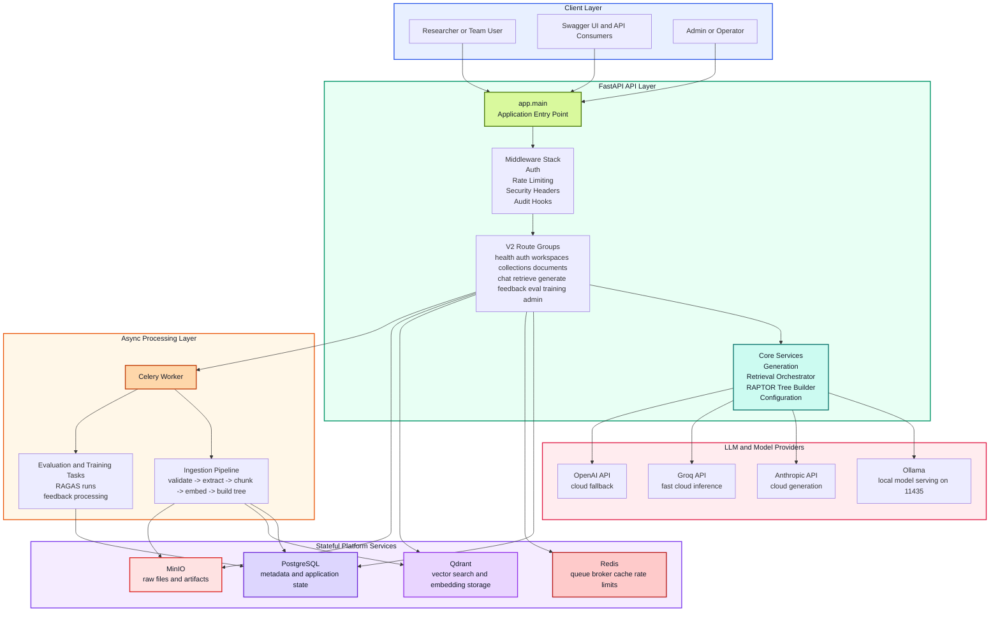
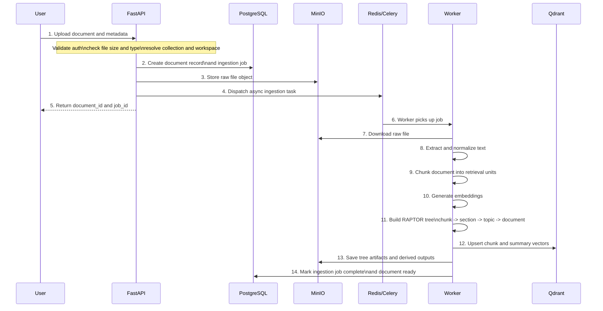
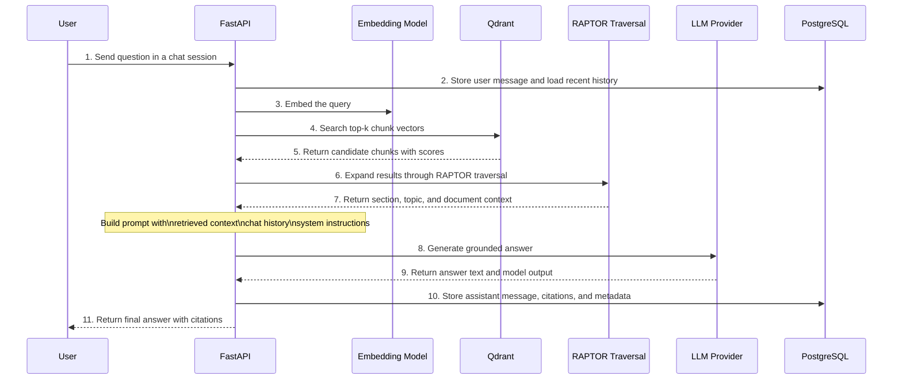
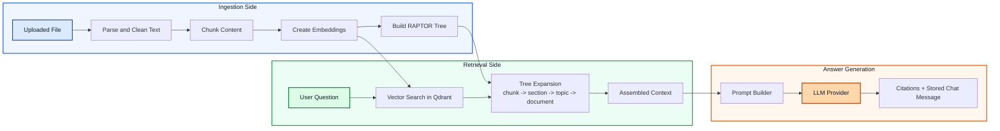

# RAPTOR RAG Platform

Production-oriented RAPTOR retrieval-augmented generation platform for document ingestion, hierarchical retrieval, chat, feedback, evaluation, and model iteration.

The repository has moved beyond the original research-demo shape. The active platform now centers on FastAPI v2 APIs, Celery workers, PostgreSQL, Redis, Qdrant, MinIO, LiteLLM-based generation, and Clerk-backed authentication.

## Current Status

- Backend platform is running on FastAPI with v2 routes under `/api/v2`
- Async ingestion and evaluation run through Celery workers
- Primary local infrastructure runs through Docker Compose
- Local generation is configured for Ollama by default
- Cloud API keys can be configured for Anthropic, Groq, and OpenAI
- Clerk auth is wired for protected routes, with development bypass available when explicitly in development and Clerk secrets are unset
- Production-readiness score is tracked in `ROADMAP_TO_100.md`

## What This Platform Does

- Upload and track documents per workspace and collection
- Parse documents into chunks and build RAPTOR trees
- Store vectors in Qdrant and metadata in PostgreSQL
- Retrieve context with vector search plus hierarchical RAPTOR traversal
- Generate grounded answers with citations
- Persist chat sessions and messages
- Collect feedback and run asynchronous evaluation / training workflows
- Expose admin, health, metrics, and operational endpoints

## Technology Stack

| Layer | Technology | Why It Exists Here |
| --- | --- | --- |
| API framework | FastAPI | Main HTTP API surface, dependency injection, OpenAPI docs, middleware integration |
| Background execution | Celery | Runs long-lived ingestion and evaluation work outside request latency budgets |
| Relational database | PostgreSQL | System-of-record for users, workspaces, documents, jobs, chat, feedback, audit, and training metadata |
| Queue / cache / rate limiting | Redis | Celery broker, short-lived cache, and request throttling state |
| Vector database | Qdrant | Stores chunk embeddings and RAPTOR summary-node embeddings for retrieval |
| Object storage | MinIO | Stores uploaded source documents and derived processing artifacts in local development |
| Local LLM serving | Ollama | Default local generation path for offline or low-cost development |
| Cloud LLM providers | Anthropic, Groq, OpenAI | Optional generation fallback and provider routing via LiteLLM |
| Authentication | Clerk | JWT-based auth and user lifecycle integration |
| Python quality tooling | Ruff, Pytest, Bandit | Linting, tests, and security checks in CI |
| Container runtime | Docker Compose | Local multi-service orchestration |

## Module Guide

### Top-level application layout

| Path | Purpose |
| --- | --- |
| `app/main.py` | Application bootstrap, router mounting, middleware registration, telemetry setup |
| `app/api/` | Legacy v1-compatible routes and MCP-style endpoints still mounted for compatibility |
| `app/api/v2/routes/` | Primary production API surface grouped by domain |
| `app/core/` | Retrieval, generation, ingestion, prompts, training, security, and runtime configuration logic |
| `app/db/` | SQLAlchemy base, models, and database session wiring |
| `app/storage/` | Vector store, object store, cache, and storage-provider abstractions |
| `app/workers/` | Celery app and async task entrypoints |
| `app/frontend/` | Legacy/demo Gradio interface used for local exploration |
| `scripts/` | One-off utilities, ingestion helpers, and smoke-test harnesses |
| `tests/` | API, core, storage, and workflow tests |

### Core module responsibilities

| Module | Purpose |
| --- | --- |
| `app/core/config.py` | Environment-backed settings, service endpoints, auth configuration, LLM/provider settings |
| `app/core/security.py` | Clerk token validation, auth middleware, role checks, development bypass behavior |
| `app/core/middleware.py` | Security headers, rate limiting, and middleware stack registration |
| `app/core/retrieval_orchestrator.py` | Main v2 retrieval pipeline: embed query, vector search, optional rerank, RAPTOR traversal, citation assembly |
| `app/core/retrieval.py` | Legacy RAPTOR retriever used by older routes and the Gradio UI |
| `app/core/generation.py` | Unified response generation layer with LiteLLM provider routing and conversational fallback |
| `app/core/llm_client.py` | Direct model/provider client logic, fine-tuned model loading, and fallback behavior |
| `app/core/raptor_tree_builder.py` | Builds hierarchical summary nodes from chunk embeddings during ingestion |
| `app/core/raptor_index.py` | Loads, saves, traverses, and summarizes RAPTOR tree artifacts |
| `app/core/ingestion.py` | Raw arXiv/PDF ingestion helpers used by scripts and legacy flows |
| `app/core/evaluation.py` | Evaluation and RAGAS-oriented scoring helpers |
| `app/core/feedback.py` | Feedback capture and persistence logic |
| `app/core/preference.py` | Converts feedback into preference datasets for tuning workflows |
| `app/core/finetune.py` | DPO-style fine-tuning orchestration and model registration |
| `app/core/learning_loop.py` | Continuous feedback-to-training loop control |
| `app/core/prompt.py` | Prompt constants and task-specific system instructions |
| `app/core/prompt_builder.py` | Prompt and message assembly for retrieved and conversational requests |

## Runtime Architecture

### High-Level Platform Diagram



### Document Ingestion Flow



### Query and Generation Flow



### How the Pieces Fit Together



### Core Services

| Layer          | Service                  | Role                                                                   |
| -------------- | ------------------------ | ---------------------------------------------------------------------- |
| API            | FastAPI                  | Public HTTP API, auth, orchestration, generation, retrieval            |
| Worker         | Celery                   | Ingestion, evaluation, background processing                           |
| Database       | PostgreSQL               | Users, workspaces, documents, chat, feedback, audit, training metadata |
| Cache / Queue  | Redis                    | Celery broker, caching, rate limiting                                  |
| Vector Store   | Qdrant                   | Chunk and summary embeddings                                           |
| Object Storage | MinIO                    | S3-compatible local storage for uploaded files and artifacts           |
| LLM            | Ollama / cloud providers | Local inference plus optional cloud fallback                           |
| Auth           | Clerk                    | User identity, JWT verification, webhook-based user sync               |

### Local Service Map

These are the currently configured local ports from `docker-compose.yml`.

| Service       | URL / Port               | Notes                                                    |
| ------------- | ------------------------ | -------------------------------------------------------- |
| API           | `http://localhost:8000`  | OpenAPI docs at `/docs`                                  |
| PostgreSQL    | `localhost:5432`         | Database `raptor`                                        |
| Redis         | `localhost:6379`         | Celery broker / cache                                    |
| Qdrant        | `http://localhost:6335`  | Host port remapped from 6333                             |
| MinIO API     | `http://localhost:9000`  | S3-compatible endpoint                                   |
| MinIO Console | `http://localhost:9002`  | Host port remapped from 9001                             |
| Ollama        | `http://localhost:11435` | Expected by the API container via `host.docker.internal` |

## API Surface

The active v2 route groups are:

- `health`
- `auth`
- `workspaces`
- `collections`
- `documents`
- `chat`
- `retrieve`
- `generate`
- `feedback`
- `eval`
- `training`
- `admin`

v1 routes remain mounted for backward compatibility but are deprecated. The application entrypoint is defined in `app/main.py`.

## V2 Route Map

| Route group | Main purpose |
| --- | --- |
| `health` | Liveness, readiness, and service-level checks |
| `auth` | Clerk webhook handling and authenticated user identity lookup |
| `workspaces` | Workspace lifecycle and ownership boundaries |
| `collections` | Collection CRUD and grouping of document corpora |
| `documents` | Upload, list, inspect, and delete document records and ingestion state |
| `chat` | Stateful chat sessions backed by retrieval and generation |
| `retrieve` | Retrieval-only access to ranked evidence and tree context |
| `generate` | Generation with or without retrieval for service-to-service use cases |
| `feedback` | User ratings and qualitative comments on assistant responses |
| `eval` | Evaluation run scheduling and results tracking |
| `training` | Fine-tuning and learning-loop orchestration |
| `admin` | Operational stats, audit visibility, and model admin functionality |

## End-to-End Architecture Summary

### Ingestion path

1. A client uploads a file into a workspace collection.
2. FastAPI writes metadata into PostgreSQL and the raw object into MinIO.
3. A Celery task is enqueued through Redis.
4. The worker validates the file, extracts text, normalizes content, chunks the document, and computes embeddings.
5. RAPTOR section/topic/document summary nodes are built.
6. Chunk vectors and summary vectors are upserted into Qdrant.
7. Tree metadata, job status, and document readiness are persisted back into PostgreSQL.

### Query path

1. A user sends a question to the chat or generation API.
2. Auth middleware resolves identity and applies route-level permissions.
3. The retrieval orchestrator embeds the query and searches Qdrant for candidate chunks.
4. RAPTOR tree traversal expands candidates into richer section/topic/document context.
5. Prompt builder assembles system instructions, retrieved context, and chat history.
6. The generation layer routes the request to Ollama or a configured cloud provider.
7. The answer, citations, and message metadata are stored in PostgreSQL and returned to the client.

## Quick Start

### 1. Prerequisites

- Docker Desktop
- Python 3.11+
- Ollama running locally if you want the default local model path
- Optional provider keys for Anthropic, Groq, or OpenAI

### 2. Create `.env`

Copy the example configuration:

```powershell
Copy-Item .env.example .env
```

Minimum fields for local development are documented in `.env.example`. The most important ones are:

- `SECRET_KEY`
- `DATABASE_URL`
- `REDIS_URL`
- `QDRANT_URL`
- `S3_ENDPOINT`
- `LLM_PROVIDER`
- `OLLAMA_BASE_URL`

Optional cloud keys:

- `ANTHROPIC_API_KEY`
- `GROQ_API_KEY`
- `OPENAI_API_KEY`
- `CLERK_SECRET_KEY`
- `CLERK_PUBLISHABLE_KEY`
- `CLERK_WEBHOOK_SECRET`

### 3. Start the stack

```powershell
docker compose up -d --build
```

### 4. Verify services

```powershell
docker compose ps
docker compose logs -f api
```

### 5. Open the platform

- API docs: `http://localhost:8000/docs`
- Live health: `http://localhost:8000/api/v2/health/live`
- MinIO console: `http://localhost:9002`
- Qdrant dashboard: `http://localhost:6335/dashboard`

## Authentication Notes

Clerk is the intended auth provider for protected v2 endpoints.

Required Clerk settings:

- `CLERK_SECRET_KEY`
- `CLERK_PUBLISHABLE_KEY`
- `CLERK_WEBHOOK_SECRET`

For local development only, auth bypass is available when:

- `ENVIRONMENT=development`
- Clerk secret key is unset

That bypass is intentionally limited and should not be used as a production configuration.

## LLM Routing Notes

The main generation path lives in `app/core/generation.py`.

Current behavior:

- Primary provider is controlled by `LLM_PROVIDER` and `LLM_MODEL`
- Local Docker defaults use Ollama with `mistral:latest`
- Anthropic credentials are supported by configuration
- Automatic fallback in the current generation layer is not yet fully symmetric across all providers

If you want production-grade multi-provider failover, track the remaining work in `ROADMAP_TO_100.md`.

## Project Layout

```text
app/
  api/
    v2/routes/         FastAPI v2 route groups
  core/                Config, security, middleware, generation, retrieval
  db/                  Session management and SQLAlchemy models
  storage/             Object storage integrations
  workers/             Celery app and background tasks
alembic/               Database migration environment
scripts/               Operational and data pipeline scripts
tests/                 API, retrieval, ingestion, evaluation, and worker tests
```

## Documentation Index

- `ARCHITECTURE.md`: system design, data flows, deployment profiles, API and storage responsibilities
- `ROADMAP_TO_100.md`: production-readiness scoring and remaining work
- `PROJECT_ROADMAP.md`: broader implementation roadmap
- `IMPLEMENTATION_PLAN.md`: phase-by-phase build plan

## Known Gaps

The platform is materially stronger than the original demo, but it is not yet finished. The biggest open areas are:

- modern frontend replacement for the legacy UI path
- backup and disaster recovery runbooks
- citation enrichment and response streaming
- cleanup of remaining legacy ChromaDB-era code paths
- stronger cloud-provider fallback and secret-hardening

Those gaps are tracked in `ROADMAP_TO_100.md`.

## Development Commands

```powershell
docker compose up -d --build
docker compose ps
docker compose logs -f api
docker compose logs -f worker
pytest
```

## Versioning Note

The application currently identifies itself as `2.0.0-alpha` in `app/main.py`. The repository contains both legacy/demo-era code and the newer production-oriented v2 platform, so documentation should be interpreted in favor of the v2 stack unless explicitly marked otherwise.
