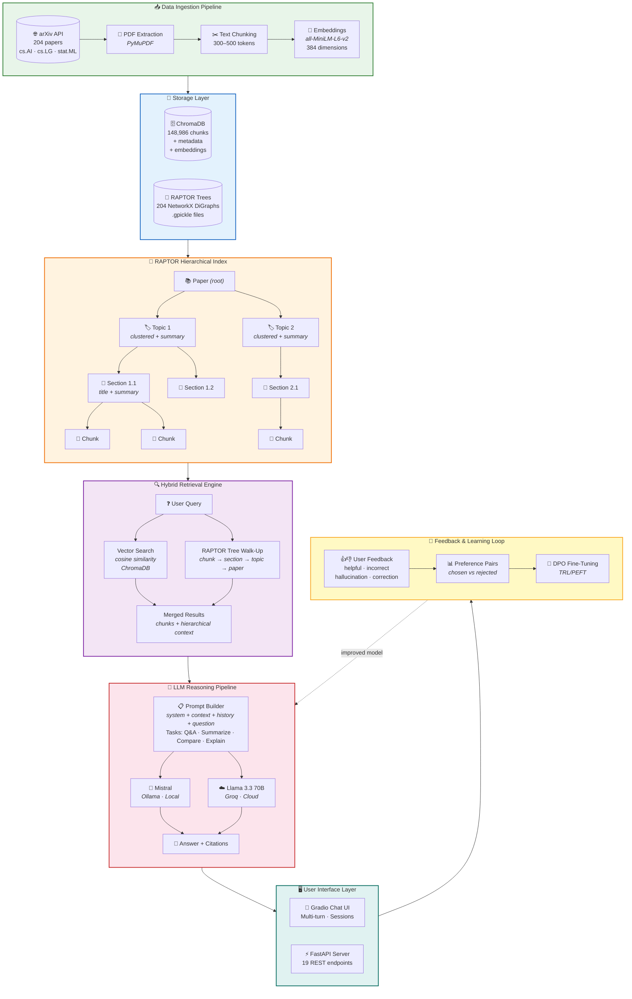
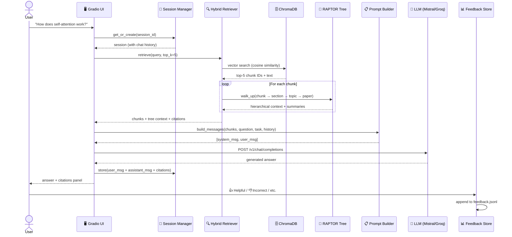
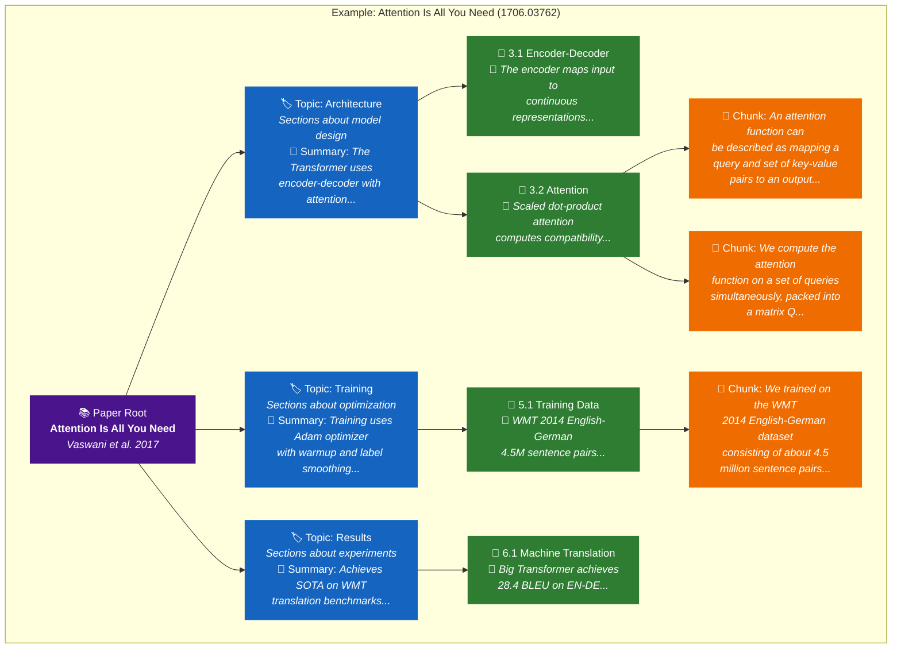
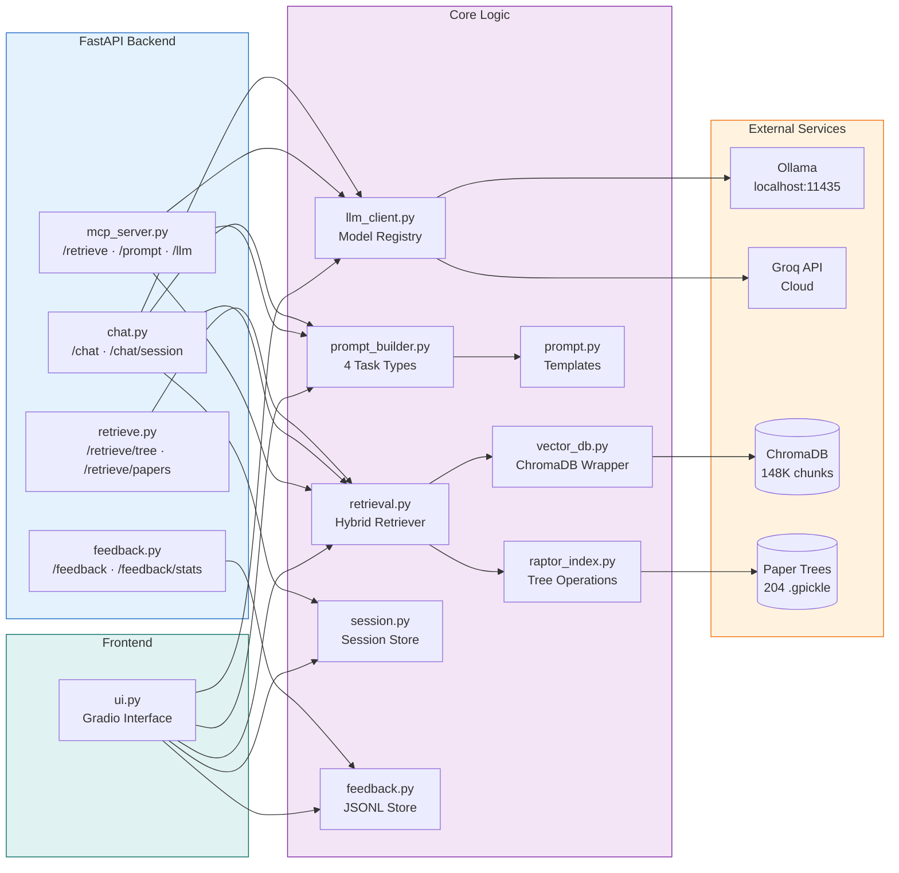
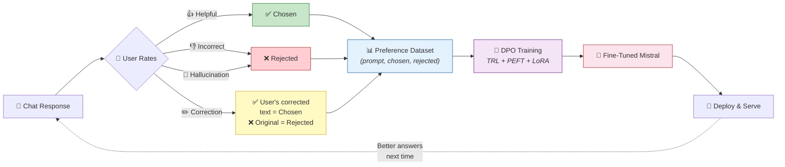

# RAPTOR Research Assistant

> **Status: In Progress** — Sections 1–10 of 18 complete. Actively building RLHF pipeline, evaluation system, and fine-tuning workflows.

A modular AI research assistant that reads, summarizes, compares, and reasons over 200+ ML/DL research papers using **RAPTOR** (Recursive Abstractive Processing for Tree-Organized Retrieval) — a hierarchical RAG approach that organizes papers into tree structures for deeper context-aware retrieval.

The system features multi-model LLM reasoning (local Ollama + cloud APIs), a two-way chatbot with session memory, user feedback collection, and a planned RLHF/DPO fine-tuning loop for continuous improvement.

---

## Architecture Overview

### High-Level System Architecture



### Request Flow — What Happens When You Ask a Question



### RAPTOR Tree Structure — How Papers Are Organized



### Component Interaction Map



### Feedback → Fine-Tuning Pipeline (Planned)



---

## Project Structure

```
raptor-research-assistant/
│
├── app/
│   ├── api/                    # FastAPI endpoints
│   │   ├── mcp_server.py       # Main server: /retrieve, /prompt, /llm
│   │   ├── chat.py             # /chat endpoints with session support
│   │   ├── feedback.py         # /feedback endpoints
│   │   ├── retrieve.py         # /retrieve router (hybrid search)
│   │   └── train.py            # /train endpoint (planned)
│   │
│   ├── core/                   # Business logic
│   │   ├── raptor_index.py     # RAPTOR tree operations (NetworkX)
│   │   ├── retrieval.py        # Hybrid retriever (vector + tree)
│   │   ├── vector_db.py        # ChromaDB wrapper
│   │   ├── prompt_builder.py   # Prompt assembly (4 task types)
│   │   ├── prompt.py           # Prompt templates
│   │   ├── llm_client.py       # Multi-model LLM client
│   │   ├── session.py          # In-memory session manager
│   │   ├── feedback.py         # Feedback storage (JSONL)
│   │   ├── embedding.py        # SentenceTransformers embeddings
│   │   ├── ingestion.py        # arXiv paper fetching
│   │   ├── pdf_processing.py   # PDF text extraction
│   │   ├── preference.py       # Preference dataset (planned)
│   │   ├── finetune.py         # DPO fine-tuning (planned)
│   │   └── evaluation.py       # RAGAS evaluation (planned)
│   │
│   ├── frontend/
│   │   └── ui.py               # Gradio chat interface
│   │
│   └── utils/
│       └── helpers.py          # Shared utilities
│
├── scripts/                    # Pipeline & utility scripts
│   ├── build_index.py          # Build RAPTOR trees + summaries
│   ├── ingest_papers.py        # Fetch papers from arXiv
│   ├── process_pdfs.py         # Extract text from PDFs
│   ├── generate_embeddings.py  # Create embeddings
│   ├── store_embeddings_in_chroma.py
│   ├── walkthrough_example.py  # Demo: full pipeline walkthrough
│   └── ...                     # Various utility scripts
│
├── tests/
│   └── test_raptor_index.py    # 27 tests for tree operations
│
├── data/                       # (gitignored — local data)
│   ├── raw/                    # PDFs, metadata, paper trees
│   ├── embeddings/             # Cached embeddings
│   ├── processed/              # Processed text
│   └── feedback/               # User feedback JSONL
│
├── config.yaml                 # All configuration
├── requirements.txt            # Python dependencies
└── PROJECT_PLAN.md             # Full 18-section project plan
```

---

## How It Works

### 1. Data Pipeline (Sections 1–4)

Papers are fetched from **arXiv** (categories: cs.AI, cs.LG, stat.ML), PDFs are extracted and split into 300–500 token chunks, each chunk is embedded using **SentenceTransformers** (`all-MiniLM-L6-v2`, 384-dim vectors), and stored in **ChromaDB** (148,986 chunks from 204 papers).

### 2. RAPTOR Hierarchical Index (Section 5)

Each paper is organized into a **4-level tree** using NetworkX:

```
Paper (root) → Topics (clustered) → Sections → Chunks
```

- **Topic clustering**: Sections with similar embeddings are grouped using Agglomerative Clustering (scikit-learn)
- **Summaries**: Each section and topic gets an LLM-generated summary for richer context
- **Tree traversal**: When a chunk is retrieved, the system walks up the tree to get section → topic → paper context

Currently: 204 papers indexed, 105 with full 4-level trees, 1,349 sections, 659 topics.

### 3. Hybrid Retrieval Engine (Section 6)

On every query, two retrieval strategies run in parallel:

1. **Vector search**: Embed the query → cosine similarity search in ChromaDB → top-K chunks
2. **RAPTOR tree walk-up**: For each retrieved chunk, walk up the tree to attach hierarchical context (section summary, topic summary, paper title)

This gives the LLM both the specific text AND the broader context of where that text fits in the paper's structure.

### 4. Prompt Construction (Section 7)

Prompts are assembled with 4 task-specific templates:

| Task | Purpose | Temperature |
|------|---------|-------------|
| **Q&A** | Answer questions from retrieved context | 0.3 |
| **Summarize** | Summarize papers or topics | 0.2 |
| **Compare** | Compare findings across papers | 0.3 |
| **Explain** | Step-by-step concept explanation | 0.4 |

Each prompt includes: System instruction → Hierarchical context blocks → Chat history → User question → Task-specific instructions.

### 5. Multi-Model LLM Reasoning (Section 8)

Supports switching between models per request:

| Model | Type | Use Case |
|-------|------|----------|
| **Mistral** (Ollama) | Local, on-device | Default for all inference, will be fine-tuned later |
| **Groq Llama 3.3 70B** | Cloud API | Bulk summarization, high-quality answers |

Task-specific generation parameters (temperature, max_tokens) are automatically applied based on the task type.

### 6. Two-Way Chatbot (Section 9)

- **Session management**: Each chat gets a unique session ID with stored history (questions, answers, citations, timestamps)
- **Multi-turn context**: Last 10 conversation turns are passed to the LLM for context-aware follow-up responses
- **Gradio UI**: Chat window + settings panel + citation display + session management
- **FastAPI endpoints**: `POST /chat`, `GET /chat/sessions`, `GET /chat/session/{id}`

### 7. Feedback System (Section 10)

After each answer, users can rate the response:

| Feedback | Meaning | Used For |
|----------|---------|----------|
| **Helpful** | Accurate and useful | "Chosen" in preference pairs |
| **Incorrect** | Factual errors | "Rejected" in preference pairs |
| **Hallucination** | Made up info not in sources | "Rejected" in preference pairs |
| **Correction** | User writes corrected answer | Corrected text becomes "chosen" |

Feedback is stored in JSONL format with full context (question, answer, citations, model, session) — ready for Section 11's preference dataset creation.

---

## API Endpoints

| Endpoint | Method | Description |
|----------|--------|-------------|
| `/retrieve` | POST | Hybrid vector + tree retrieval |
| `/retrieve/tree` | POST | Browse by topic/section |
| `/retrieve/papers` | GET | List all 204 paper IDs |
| `/retrieve/paper/{id}` | GET | Paper tree overview |
| `/prompt` | POST | Retrieve + build prompt |
| `/llm` | POST | Full pipeline: retrieve → prompt → LLM answer |
| `/llm/models` | GET | List available models |
| `/llm/health` | GET | Check if LLM is responding |
| `/chat` | POST | Session-aware chat (auto-creates session) |
| `/chat/session` | POST | Create new session |
| `/chat/session/{id}` | GET | Get session history |
| `/chat/sessions` | GET | List all sessions |
| `/chat/session/{id}` | DELETE | Delete session |
| `/feedback` | POST | Submit feedback |
| `/feedback` | GET | Get all feedback |
| `/feedback/stats` | GET | Feedback statistics |
| `/feedback/session/{id}` | GET | Feedback for a session |
| `/feedback/type/{type}` | GET | Filter by feedback type |

---

## Quick Start

### Prerequisites

- Python 3.10+
- [Ollama](https://ollama.ai/) with Mistral model pulled (`ollama pull mistral`)

### Setup

```bash
# Clone the repo
git clone https://github.com/priyankmistry21699-web/raptor-research-assistant.git
cd raptor-research-assistant

# Create virtual environment
python -m venv .venv
.venv\Scripts\activate  # Windows
# source .venv/bin/activate  # Linux/Mac

# Install dependencies
pip install -r requirements.txt

# Create .env file
echo LLM_API_KEY=ollama > .env
echo LLM_API_URL=http://localhost:11434/v1/chat/completions >> .env
echo LLM_MODEL=mistral:latest >> .env
```

### Run

```bash
# Option 1: Gradio Chat UI (interactive)
python -m app.frontend.ui
# Opens at http://localhost:7860

# Option 2: FastAPI Server (API)
uvicorn app.api.mcp_server:app --port 8000
# API docs at http://localhost:8000/docs
```

---

## Tech Stack

| Component | Technology |
|-----------|-----------|
| **Embeddings** | SentenceTransformers (all-MiniLM-L6-v2) |
| **Vector DB** | ChromaDB |
| **Tree Index** | NetworkX (DiGraph) |
| **Clustering** | scikit-learn (Agglomerative) |
| **LLM (local)** | Ollama + Mistral |
| **LLM (cloud)** | Groq API + Llama 3.3 70B |
| **Backend** | FastAPI + Pydantic |
| **Frontend** | Gradio |
| **Feedback** | JSONL file storage |
| **Config** | YAML |
| **Data Source** | arXiv API |

---

## Roadmap

- [x] **Section 1** — Data Ingestion (arXiv API, 204 papers)
- [x] **Section 2** — PDF Processing & Chunking
- [x] **Section 3** — Embedding Generation (384-dim)
- [x] **Section 4** — Vector Database (ChromaDB, 148K chunks)
- [x] **Section 5** — RAPTOR Hierarchical Index (NetworkX trees)
- [x] **Section 6** — Hybrid Retrieval Engine
- [x] **Section 7** — Prompt Construction (4 task types)
- [x] **Section 8** — Multi-Model LLM Reasoning
- [x] **Section 9** — Two-Way Chatbot with Sessions
- [x] **Section 10** — Feedback System
- [ ] **Section 11** — Preference Dataset Creation (DPO pairs)
- [ ] **Section 12** — Model Fine-Tuning (TRL/PEFT + DPO)
- [ ] **Section 13** — Continuous Learning Loop
- [ ] **Section 14** — Evaluation System (RAGAS)
- [ ] **Section 15** — Backend System (unified FastAPI)
- [ ] **Section 16** — Frontend Interface (full Gradio UI)
- [ ] **Section 17** — DevOps & Scalability
- [ ] **Section 18** — Paper-Specific Learning & Debate

---

## Data Stats

| Metric | Value |
|--------|-------|
| Papers indexed | 204 |
| Total chunks | 148,986 |
| Sections | 1,349 |
| Topics | 659 |
| Papers with 4-level trees | 105 |
| Embedding dimensions | 384 |
| Categories | cs.AI, cs.LG, stat.ML |

---

## License

This project is for educational and research purposes.

---

*Built with RAPTOR RAG, Ollama, ChromaDB, and a lot of research papers.*
